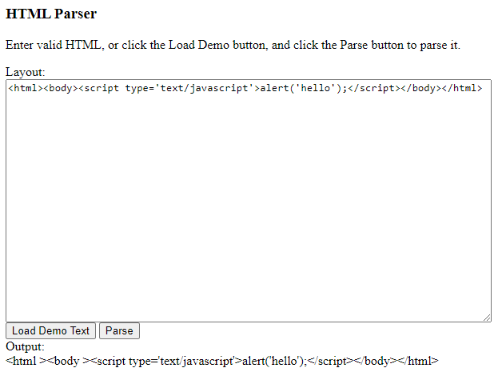

HtmlParser
==========

A HTML parser implemented in JavaScript.

Note that JavaScript has built-in things that can do this better.
This is meant as a starting point for parsing HTML in other languages.

